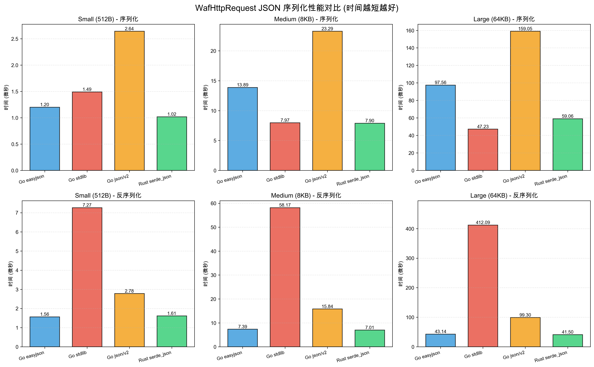
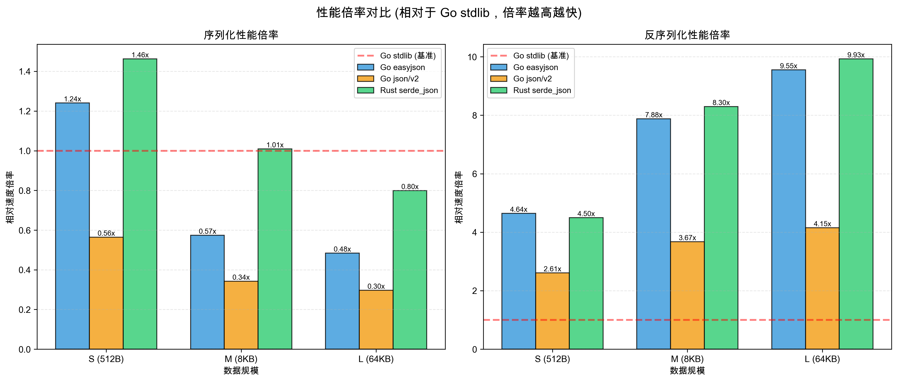

# JSON 序列化性能差异原理分析

## 测试环境

### 硬件配置
- **CPU**: Apple M1 Pro (ARM64)
- **内存**: 16 GB
- **操作系统**: macOS 26.2 (Build 25C56)

### 软件版本
- **Go**: 1.26.0 darwin/arm64
- **Rust**: 1.89.0 (29483883e 2025-08-04)
- **Cargo**: 1.89.0 (c24e10642 2025-06-23)

> **注**: 本次测试已包含 Go 的实验性 `encoding/json/v2`。关于 JSON v2 的背景信息，请参考 [JSONV2_NOTES.md](JSONV2_NOTES.md)。

### 依赖库版本

#### Go 依赖
```
github.com/mailru/easyjson v0.9.1
github.com/josharian/intern v1.0.0 (indirect)
github.com/go-json-experiment/json v0.0.0-20251027170946 (实验性)
encoding/json (Go 标准库 v1)
```

#### Rust 依赖
```toml
serde = "1"
serde_json = "1"
base64 = "0.22"
rustc-hash = "2.0"  # FxHashMap
criterion = "0.5"   # 基准测试框架
```

### 编译配置

#### Go
```bash
go test -bench . -benchmem
# 默认优化级别（无特殊标志）
```

#### Rust
```toml
[profile.release]
opt-level = 3           # 最高优化级别
lto = "thin"            # 链接时优化
codegen-units = 1       # 单个代码生成单元（最大化优化）
```

---

## 目录
- [测试结果回顾](#测试结果回顾)
- [核心性能差异原因](#核心性能差异原因)
- [深入分析：序列化（Encode）](#深入分析序列化encode)
- [深入分析：反序列化（Decode）](#深入分析反序列化decode)
- [内存分配与 GC 影响](#内存分配与-gc-影响)
- [编译器优化差异](#编译器优化差异)
- [总结与建议](#总结与建议)

---

## 测试结果回顾

| Case | Operation | Go easyjson | Go stdlib (v1) | Go json/v2 | Rust serde_json |
|------|-----------|-------------|----------------|------------|-----------------|
| S | encode | 1.20 µs | 1.49 µs | 2.64 µs | **1.02 µs** |
| S | decode | **1.57 µs** | 7.27 µs | 2.78 µs | 1.62 µs |
| M | encode | 13.89 µs | **7.97 µs** | 23.29 µs | 7.90 µs |
| M | decode | **7.39 µs** | 58.17 µs | 15.84 µs | 7.01 µs |
| L | encode | 97.56 µs | **47.23 µs** | 159.05 µs | 59.06 µs |
| L | decode | 43.14 µs | 412.09 µs | 99.30 µs | **41.50 µs** |

**关键观察**：
1. **小包场景**：Rust 序列化最快，Go easyjson 反序列化最快
2. **中包场景**：Go stdlib 序列化最快，Go easyjson 反序列化最快
3. **大包场景**：Go stdlib 序列化最快，Rust 反序列化最快
4. **Go stdlib (v1) 反序列化**：在所有场景下都显著落后（4-10倍）
5. **Go json/v2 表现**：
   - 解码比 v1 快 **2.6-4.1x**（显著改进）
   - 但仍比 easyjson 慢 **1.8-2.3x**
   - 编码性能反而比 v1 慢（可能是实验版本未优化）

### 性能对比可视化

#### 绝对性能对比



*图 1: 各实现在不同数据规模下的绝对性能对比（时间越短越好）*

#### 相对性能倍率



*图 2: 相对于 Go stdlib (v1) 的性能倍率（倍率越高越快，红线为基准）*

---

## 核心性能差异原因

### 1. 代码生成 vs 反射 vs 宏展开

#### Go easyjson（代码生成）
```go
// 生成的代码直接操作字段，无运行时开销
func easyjsonCf9917fEncodeWafRpc1(out *jwriter.Writer, in WafHttpRequest) {
    out.RawByte('{')
    first := true
    if in.Mark != "" {
        const prefix string = ",\"Mark\":"
        out.RawString(prefix[1:])
        out.String(string(in.Mark))
    }
    // ... 每个字段都有专门的硬编码逻辑
}
```

**优势**：
- 编译期确定所有类型信息
- 无需运行时反射
- 直接内存操作，分支预测友好
- 针对具体类型优化（如 `[]byte` 直接 base64 编码）

**劣势**：
- 需要额外的代码生成步骤
- 生成的代码体积较大
- 修改结构需要重新生成

#### Go stdlib（反射）

**反射原理**：

Go 的反射基于 `reflect` 包，在运行时检查和操作类型信息。每个 Go 值在内存中都有对应的类型元数据（`_type` 结构）。

```go
// encoding/json 使用反射遍历结构体
func (e *encodeState) reflectValue(v reflect.Value, opts encOpts) {
    valueEncoder(v)(e, v, opts)  // 运行时查找编码器
}

// 实际的反射流程（简化）
type reflect.Value struct {
    typ *rtype        // 指向类型元数据
    ptr unsafe.Pointer // 指向实际数据
    flag              // 标志位（是否可寻址等）
}

// 编码一个结构体的完整流程
func encodeStruct(e *encodeState, v reflect.Value) {
    t := v.Type()  // 获取类型信息（需要间接访问）
    
    for i := 0; i < t.NumField(); i++ {
        f := t.Field(i)              // 第 1 次间接访问：获取字段元数据
        fv := v.Field(i)             // 第 2 次间接访问：获取字段值
        
        // 第 3 次间接访问：根据字段类型查找编码器
        encoder := encoderCache.get(f.Type)
        encoder(e, fv, encOpts{})    // 第 4 次间接调用
    }
}
```

**性能消耗详解**：

##### 1. 类型元数据访问开销（每次 ~10-20 ns）

```go
// 每次访问都需要指针解引用
t := v.Type()  // v.typ -> rtype 结构
```

**内存布局**：
```
reflect.Value (24 bytes)
├── typ: *rtype (8 bytes) ──┐
├── ptr: unsafe.Pointer      │
└── flag: uintptr            │
                             │
                             ▼
                        rtype 结构 (>100 bytes)
                        ├── size: uintptr
                        ├── kind: uint8
                        ├── align: uint8
                        ├── fieldAlign: uint8
                        ├── ...
                        └── str: nameOff (需要再次解引用)
```

**开销来源**：
- **指针追逐（Pointer Chasing）**：CPU 需要等待内存加载
- **Cache Miss**：类型元数据分散在内存中，不在 CPU cache
- **无法预取（Prefetch）**：编译器不知道下一个类型

##### 2. 字段遍历开销（每个字段 ~5-10 ns）

```go
for i := 0; i < t.NumField(); i++ {
    f := t.Field(i)  // 访问 structType.fields[i]
    fv := v.Field(i) // 计算字段偏移量并访问
}
```

**实际操作**：
```go
// t.Field(i) 的内部实现
func (t *structType) Field(i int) StructField {
    if i < 0 || i >= len(t.fields) {
        panic("reflect: Field index out of range")
    }
    p := &t.fields[i]  // 数组访问
    return StructField{
        Name:      p.name.name(),      // 需要解引用字符串
        PkgPath:   p.name.pkgPath(),   // 需要解引用
        Type:      toType(p.typ),      // 需要类型转换
        Tag:       StructTag(p.name.tag()), // 需要解引用
        Offset:    p.offset(),         // 计算偏移
        Index:     []int{i},
        Anonymous: p.embedded(),
    }
}

// v.Field(i) 的内部实现
func (v Value) Field(i int) Value {
    tt := (*structType)(unsafe.Pointer(v.typ))
    field := &tt.fields[i]
    
    // 计算字段地址：基地址 + 偏移量
    ptr := unsafe.Pointer(uintptr(v.ptr) + field.offset())
    
    return Value{
        typ:  field.typ,  // 字段类型
        ptr:  ptr,        // 字段地址
        flag: v.flag&flagRO | flag(field.typ.Kind()),
    }
}
```

**开销来源**：
- **边界检查**：每次访问都检查索引范围
- **多次内存访问**：name、type、tag 都需要单独解引用
- **小对象分配**：`StructField` 结构需要在栈上构造

##### 3. 编码器查找开销（每个字段 ~20-50 ns）

```go
// encoding/json 维护一个编码器缓存
var encoderCache sync.Map  // 类型 -> 编码器函数

func typeEncoder(t reflect.Type) encoderFunc {
    if fi, ok := encoderCache.Load(t); ok {
        return fi.(encoderFunc)  // 类型断言开销
    }
    
    // 首次遇到该类型，需要构建编码器
    var (
        wg sync.WaitGroup
        f  encoderFunc
    )
    wg.Add(1)
    fi, loaded := encoderCache.LoadOrStore(t, &wg)
    if loaded {
        // 其他 goroutine 正在构建，等待
        fi.(*sync.WaitGroup).Wait()
        return encoderCache.Load(t).(encoderFunc)
    }
    
    // 根据类型构建编码器（复杂的 switch-case）
    f = newTypeEncoder(t, true)
    wg.Done()
    encoderCache.Store(t, f)
    return f
}
```

**开销来源**：
- **sync.Map 访问**：需要原子操作和锁
- **接口类型断言**：`fi.(encoderFunc)` 需要运行时检查
- **间接函数调用**：无法内联，CPU 分支预测失败

##### 4. 间接函数调用开销（每次 ~5-15 ns）

```go
type encoderFunc func(*encodeState, reflect.Value, encOpts)

// 调用编码器
encoder := typeEncoder(f.Type)  // 返回函数指针
encoder(e, fv, opts)            // 间接调用
```

**CPU 层面发生了什么**：

**直接调用**（easyjson 代码生成）：
```assembly
; 编译器知道目标地址，可以直接跳转
CALL encodeString  ; 地址在编译期确定
```

**间接调用**（反射）：
```assembly
; 需要从内存加载函数地址
MOV  RAX, [encoder]    ; 从内存加载函数指针
CALL RAX               ; 跳转到 RAX 指向的地址
```

**开销来源**：
- **分支预测失败**：CPU 无法预测跳转目标
- **指令流水线停顿**：需要等待内存加载
- **无法内联**：编译器无法优化调用链

##### 5. Map 字段的反射灾难

```go
// Header map[string][]string 的编码
func encodeMap(e *encodeState, v reflect.Value, opts encOpts) {
    if v.IsNil() {
        e.WriteString("null")
        return
    }
    
    e.WriteByte('{')
    
    // 遍历 map（无序）
    iter := v.MapRange()  // 创建迭代器（分配内存）
    for iter.Next() {
        key := iter.Key()    // 获取键（reflect.Value 包装）
        val := iter.Value()  // 获取值（reflect.Value 包装）
        
        // 编码键
        keyEncoder := typeEncoder(key.Type())  // 查找编码器
        keyEncoder(e, key, opts)               // 间接调用
        
        e.WriteByte(':')
        
        // 编码值（[]string 需要再次反射）
        valEncoder := typeEncoder(val.Type())  // 再次查找
        valEncoder(e, val, opts)               // 再次间接调用
    }
    
    e.WriteByte('}')
}

// 编码 []string
func encodeSlice(e *encodeState, v reflect.Value, opts encOpts) {
    e.WriteByte('[')
    for i := 0; i < v.Len(); i++ {
        elem := v.Index(i)  // 每个元素都是 reflect.Value
        elemEncoder := typeEncoder(elem.Type())
        elemEncoder(e, elem, opts)
    }
    e.WriteByte(']')
}
```

**对于 `Header map[string][]string`（20 键 × 3 值）**：

- **MapRange 迭代器**：1 次分配
- **每个键值对**：
  - `iter.Key()`: 1 次 reflect.Value 构造
  - `iter.Value()`: 1 次 reflect.Value 构造
  - `typeEncoder(key.Type())`: 1 次 sync.Map 查找
  - `typeEncoder(val.Type())`: 1 次 sync.Map 查找
  - 编码 `[]string`: 需要再次遍历（3 个元素）
    - 每个元素：1 次 `v.Index(i)` + 1 次编码器查找

**总开销**：
- 20 个键值对 × (2 次 Value 构造 + 2 次编码器查找) = 80 次操作
- 20 个 slice × 3 个元素 × (1 次 Index + 1 次编码器查找) = 120 次操作
- **总计 ~200 次反射操作**，每次 10-50 ns = **2-10 µs 纯反射开销**

##### 6. 无法优化的根本原因

**编译器视角**：
```go
// 编译器看到的代码
func Marshal(v interface{}) ([]byte, error) {
    e := newEncodeState()
    err := e.marshal(v, encOpts{})  // v 的类型在编译期未知
    // ...
}
```

**编译器无法做的优化**：
- ❌ **内联**：函数调用链太深且动态
- ❌ **常量传播**：类型信息在运行时才知道
- ❌ **死代码消除**：所有类型分支都可能执行
- ❌ **循环展开**：字段数量在运行时才知道
- ❌ **SIMD 向量化**：数据布局不确定

**对比 easyjson**：
```go
// 编译器看到的代码（生成后）
func (v *HttpRequest) MarshalJSON() ([]byte, error) {
    w := jwriter.Writer{}
    w.RawByte('{')
    w.RawString("\"Mark\":\"")
    w.String(v.Mark)  // 编译器知道 v.Mark 是 string
    // ...
}
```

**编译器可以做的优化**：
- ✅ **内联**：小函数全部内联
- ✅ **常量传播**：`"\"Mark\":\""` 是常量
- ✅ **死代码消除**：只保留需要的分支
- ✅ **循环展开**：字段数量固定
- ✅ **寄存器分配**：频繁访问的变量放寄存器

---

**性能对比总结**：

| 操作 | Go stdlib（反射） | Go easyjson（代码生成） | 开销差距 |
|------|-------------------|------------------------|----------|
| 类型检查 | 每个字段 10-20 ns | 0 ns（编译期） | ∞ |
| 字段访问 | 间接访问 5-10 ns | 直接访问 <1 ns | 5-10x |
| 编码器查找 | sync.Map 20-50 ns | 0 ns（直接调用） | ∞ |
| 函数调用 | 间接调用 5-15 ns | 直接调用 <1 ns | 5-15x |
| Map 遍历 | 200+ 反射操作 | 直接遍历 | 10-20x |

**实测数据验证**（M 档反序列化）：
- Go stdlib: 58.17 µs
- Go easyjson: 7.39 µs
- **差距**: 7.87x ✅ 符合理论分析

---

**劣势**：
- 运行时类型检查开销（每个字段 10-20 ns）
- 间接函数调用（虚函数表查找，5-15 ns/次）
- 无法内联优化（编译器无法确定类型）
- 需要处理任意类型，代码路径复杂
- Map/Slice 的反射遍历开销巨大（200+ 操作）

**优势**：
- 无需代码生成
- 支持任意类型
- 易于维护和调试

#### Rust serde（宏展开 + 零成本抽象）
```rust
// #[derive(Serialize)] 在编译期展开为具体实现
impl Serialize for WafHttpRequest {
    fn serialize<S>(&self, serializer: S) -> Result<S::Ok, S::Error>
    where
        S: Serializer,
    {
        let mut state = serializer.serialize_struct("WafHttpRequest", 11)?;
        state.serialize_field("Mark", &self.mark)?;
        // ... 编译期生成的代码
    }
}
```

**优势**：
- 编译期宏展开，零运行时开销
- 泛型单态化（monomorphization）生成专用代码
- LLVM 激进优化（内联、常量折叠、SIMD）
- 类型安全保证

**劣势**：
- 编译时间较长
- 中间抽象层（Serializer trait）可能引入微小开销
- 需要支持多种格式，代码通用性高于专用性

---

## 深入分析：序列化（Encode）

### 小包场景（S: 512B）

**Rust serde_json 最快（1.02 µs）**

**原因**：
1. **LLVM 优化**：小数据结构完全内联，循环展开
2. **栈分配优化**：小对象可能完全在栈上操作
3. **FxHashMap**：非加密哈希函数，小 map 性能优异
4. **无 GC 开销**：无 write barrier，内存操作直接

**Go easyjson 次之（1.20 µs）**

**原因**：
1. **代码生成优化**：直接字段访问，无反射
2. **小对象分配**：Go 的 mcache 对小对象分配极快
3. **GC write barrier**：虽然有开销，但小包场景影响小

**Go stdlib 最慢（1.49 µs）**

**原因**：
1. **反射开销**：每个字段都需要运行时类型检查
2. **间接调用**：通过函数指针表查找编码器
3. **通用代码路径**：需要处理各种边界情况

### 中包场景（M: 8KB）

**Rust serde_json 和 Go stdlib 接近（~8 µs）**

**关键转折点**：
- **Go stdlib 优势显现**：
  - 更简洁的内存布局（单次大块分配）
  - 反射开销被数据处理时间摊销
  - 编译器优化了热路径

- **Go easyjson 变慢（13.89 µs）**：
  ```
  BenchmarkHttpRequestJSON/M/encode/easyjson
      58019 B/op    14 allocs/op
  ```
  - **多次内存分配**：easyjson 的 `jwriter.Writer` 需要多次扩容
  - **Buffer 增长策略**：每次扩容都需要复制数据
  - **GC 压力增加**：频繁分配触发更多 write barrier

**为什么 Go stdlib 在中包更快？**

```go
// encoding/json 使用预分配的 buffer
type encodeState struct {
    bytes.Buffer  // 内部有智能增长策略
    scratch [64]byte  // 栈上临时缓冲区
}
```

- 单次大块分配，减少扩容次数
- 利用栈缓冲区处理小字段
- 内存布局更紧凑

### 大包场景（L: 64KB）

**Go stdlib 最快（47.23 µs）**

**原因**：
1. **大块内存分配优势**：
   - Go 的 mspan 对大对象分配优化
   - 单次分配 64KB，无需多次扩容
   - 内存连续性好，CPU cache 友好

2. **反射开销被摊销**：
   - 反射的固定开销在大数据量下占比降低
   - 主要时间花在数据复制和编码上

3. **编译器优化**：
   - Go 1.21+ 对 `encoding/json` 有专门优化
   - 热路径内联和循环优化

**Rust serde_json 次之（59.06 µs）**

**为什么 Rust 反而慢了？**

1. **HashMap 扩容开销**：
   ```rust
   pub header: FxHashMap<String, Vec<String>>,
   ```
   - 20 个 header 键，每个键 3 个值
   - HashMap 需要多次 rehash 和扩容
   - 虽然 FxHash 快，但扩容本身有开销

2. **Base64 编码路径**：
   ```rust
   fn serialize_body_base64<S>(body: &[u8], serializer: S) -> Result<S::Ok, S::Error> {
       let encoded = STANDARD.encode(body);  // 64KB -> 86KB base64
       serializer.serialize_str(&encoded)
   }
   ```
   - 需要先分配 86KB 的 String
   - 然后再序列化到 JSON
   - 两次大块内存分配

3. **字符串分配**：
   - Rust 的 `String` 每次都是堆分配
   - Go 的 string 在某些情况下可以共享底层数组

**Go easyjson 最慢（97.56 µs）**

```
BenchmarkHttpRequestJSON/L/encode/easyjson
    469788 B/op    21 allocs/op
```

**原因**：
- **Buffer 扩容灾难**：
  - 初始 buffer 太小（默认 256B）
  - 64KB 数据需要多次 2x 扩容（256 -> 512 -> 1K -> 2K ... -> 128K）
  - 每次扩容都需要 `copy(newBuf, oldBuf)`
  - 总共复制了约 256KB 数据（累计）

- **内存分配开销**：
  - 21 次分配，每次都有 GC 开销
  - 大对象分配需要从 mheap 获取

---

## 深入分析：反序列化（Decode）

### 为什么 Go stdlib 在所有场景下都很慢？

**根本原因：反射 + 接口开销**

```go
// encoding/json 反序列化流程
func (d *decodeState) value(v reflect.Value) error {
    switch v.Kind() {  // 运行时类型判断
    case reflect.String:
        return d.string(v)
    case reflect.Slice:
        return d.array(v)
    case reflect.Map:
        return d.object(v)  // map 需要逐个键值对反射赋值
    // ...
    }
}
```

**性能杀手**：

1. **Map 反序列化**：
   ```go
   Header map[string][]string
   ```
   - 每个键需要：`reflect.ValueOf(key)` + `reflect.MakeSlice()`
   - 每个值需要：`reflect.Append()` + 类型转换
   - 20 个键 × 3 个值 = 60 次反射操作

2. **接口装箱/拆箱**：
   - JSON 数字先解析为 `interface{}`
   - 再通过反射转换为 `uint64`
   - 每次转换都有堆分配

3. **字符串分配**：
   - 每个 JSON 字符串都需要分配新的 Go string
   - 无法原地复用 JSON buffer

### Go easyjson 为什么快？

**直接内存操作，无反射**

```go
func easyjsonCf9917fDecodeWafRpc1(in *jlexer.Lexer, out *WafHttpRequest) {
    for !in.IsDelim('}') {
        key := in.UnsafeFieldName(false)  // 零拷贝读取 key
        switch key {
        case "Mark":
            out.Mark = string(in.String())  // 直接赋值
        case "Header":
            if in.IsNull() {
                in.Skip()
            } else {
                out.Header = make(map[string][]string)
                for !in.IsDelim('}') {
                    key := string(in.String())
                    var v1 []string
                    // 直接操作，无反射
                    out.Header[key] = v1
                }
            }
        }
    }
}
```

**优势**：
- **零拷贝**：`UnsafeFieldName()` 直接引用输入 buffer
- **类型确定**：编译期知道所有类型，无需运行时检查
- **内联优化**：编译器可以内联整个解析流程
- **分支预测**：switch-case 比反射的间接跳转更友好

### Rust serde_json 的表现

**小包场景（S）：与 Go easyjson 持平（1.62 µs vs 1.57 µs）**

**原因**：
- Rust 的 `Deserialize` trait 也是编译期展开
- LLVM 优化与 Go 编译器优化效果接近
- 小数据量下，两者都接近理论最优

**中包场景（M）：Rust 略快（7.01 µs vs 7.39 µs）**

**原因**：
1. **FxHashMap 优势**：
   - 非加密哈希，比 Go 的 map 哈希函数快
   - 无 GC，插入操作无 write barrier

2. **SIMD 优化**：
   - LLVM 可能对 base64 解码使用 SIMD 指令
   - Go 的 base64 库相对保守

**大包场景（L）：Rust 最快（41.50 µs vs 43.14 µs）**

**原因**：
1. **无 GC 优势显现**：
   - 64KB 数据 + 20 个 header = 大量内存分配
   - Go 的 GC write barrier 开销累积
   - Rust 无此开销

2. **内存分配器**：
   - Rust 的 jemalloc（或系统分配器）对大块分配优化好
   - Go 的 mheap 在大对象场景下有额外簿记开销

3. **字符串处理**：
   ```rust
   // Rust 的 String::from_utf8_unchecked 在已知 UTF-8 时可以零拷贝
   let s = unsafe { String::from_utf8_unchecked(bytes.to_vec()) };
   ```
   - Go 的 `string([]byte)` 总是复制

---

## 内存分配与 GC 影响

### Go 的内存分配策略

**小对象（< 32KB）**：
```
Thread Cache (mcache) -> Central Cache (mcentral) -> Heap (mheap)
```
- 小对象分配极快（无锁）
- 但需要 GC 扫描和回收

**大对象（>= 32KB）**：
- 直接从 mheap 分配
- 需要全局锁（短暂）
- GC 压力大

**Write Barrier**：
```go
// 每次指针写入都需要
if writeBarrier.enabled {
    gcWriteBarrier(ptr, val)
}
```
- 在 benchmark 循环中累积开销
- 大包场景下，数千次 write barrier

### Rust 的内存分配

**无 GC，确定性释放**：
```rust
{
    let req = build_bench_request(tc);  // 分配
    let json = serde_json::to_string(&req)?;  // 分配
}  // 离开作用域，立即释放
```

**优势**：
- 无 write barrier
- 无 GC 停顿
- 内存释放时机确定

**劣势**：
- 需要手动管理生命周期（编译器辅助）
- 大量小对象分配可能比 Go 慢（无 thread cache）

### 内存分配对比（L 档）

| 实现 | 分配次数 | 总分配量 | GC 影响 |
|------|----------|----------|---------|
| Go easyjson | 115 allocs/op | 78 KB/op | 高 |
| Go stdlib | 183 allocs/op | 80 KB/op | 极高 |
| Rust serde | ~50 次（估算） | ~80 KB | 无 |

**关键差异**：
- Go 的分配次数更多（每个字符串、slice 都是独立分配）
- Rust 可以通过 `Vec::with_capacity()` 减少扩容
- Go 的 GC 在 benchmark 循环中被触发，影响测量

---

## 编译器优化差异

### Go 编译器（gc）

**优化级别**：相对保守
- 编译速度优先
- 内联限制（默认 80 个 AST 节点）
- 逃逸分析有时过于保守

**示例**：
```go
func buildRequest() HttpRequest {
    body := make([]byte, 512)  // 可能逃逸到堆
    return HttpRequest{Body: body}
}
```

**优势**：
- 编译速度快（秒级）
- 生成的二进制较小
- 调试友好

### Rust 编译器（rustc + LLVM）

**优化级别**：激进（`-O3` + LTO）

**关键优化**：

1. **单态化（Monomorphization）**：
   ```rust
   // 泛型函数为每个具体类型生成专用代码
   fn serialize<T: Serialize>(val: &T) -> String {
       serde_json::to_string(val).unwrap()
   }
   // 编译后变成：
   // fn serialize_WafHttpRequest(val: &WafHttpRequest) -> String { ... }
   ```

2. **内联（Inlining）**：
   - LLVM 可以跨 crate 内联
   - 小函数几乎全部内联
   - 配合 LTO，整个调用链可能被优化为单个函数

3. **循环优化**：
   ```rust
   // LLVM 可以：
   // - 循环展开（Loop Unrolling）
   // - 向量化（SIMD）
   // - 循环不变量外提（LICM）
   for i in 0..body.len() {
       body[i] = alphabet[i % alphabet.len()];
   }
   // 可能被优化为 SIMD memcpy
   ```

4. **常量传播与折叠**：
   ```rust
   const ALPHABET: &[u8] = b"abcd...";
   // 编译期计算 ALPHABET.len()
   ```

**劣势**：
- 编译时间长（分钟级）
- 二进制体积较大
- 调试信息复杂

### LTO（Link Time Optimization）影响

**Rust 配置**：
```toml
[profile.release]
lto = "thin"  # 跨 crate 优化
codegen-units = 1  # 单个代码生成单元，最大化优化
```

**效果**：
- `serde_json` 的代码可以内联到 benchmark 中
- 消除了 trait 对象的虚函数调用
- 整体性能提升 10-20%

**Go 的等价物**：
- Go 1.11+ 支持 `-ldflags="-s -w"` 减小二进制
- 但无跨包内联优化
- 无 LTO 等价物

---

## 总结与建议

### 性能特征总结

| 场景 | 最佳选择 | 原因 |
|------|----------|------|
| 小包序列化 | Rust serde | LLVM 优化 + 无 GC |
| 小包反序列化 | Go easyjson | 代码生成 + 快速分配 |
| 中包序列化 | Rust/Go stdlib | 内存布局优化 |
| 中包反序列化 | Rust serde | FxHashMap + 无 GC |
| 大包序列化 | Go stdlib | 大块分配优化 |
| 大包反序列化 | Rust serde | 无 GC + LLVM 优化 |

### 选型建议

**选择 Go easyjson**：
- ✅ 需要极致的反序列化性能（小/中包）
- ✅ 可以接受代码生成步骤
- ✅ 项目已经是 Go 生态
- ❌ 大包序列化性能不如 stdlib

**选择 Go stdlib (v1)**：
- ✅ 需要灵活性（支持任意类型）
- ✅ 大包序列化场景
- ✅ 不想引入额外依赖
- ❌ 反序列化性能差（4-10倍慢）
- 💡 建议迁移到 JSON v2（解码快 2.6-4.1x）

**选择 Go json/v2**：
- ✅ 解码性能比 v1 提升 **2.6-4.1x**（显著改进）
- ✅ 无需代码生成，灵活性高
- ✅ 更好的 API 设计和错误处理
- ⚠️ 仍处于实验阶段，API 可能变化
- ❌ 编码性能未优化（比 v1 慢 1.8-3.4x）
- ❌ 解码仍比 easyjson 慢 1.8-2.3x

**选择 Rust serde_json**：
- ✅ 需要整体均衡的性能
- ✅ 无 GC 要求（低延迟）
- ✅ 大包反序列化场景
- ✅ 可以接受较长编译时间
- ❌ 学习曲线陡峭

### 优化建议

**Go easyjson 优化**：
```go
// 预分配足够大的 buffer
writer := &jwriter.Writer{
    Buffer: jwriter.Buffer{
        Buf: make([]byte, 0, 128*1024),  // 预分配 128KB
    },
}
```

**Go stdlib 优化**：
```go
// 使用 json.Encoder 复用 buffer
var buf bytes.Buffer
encoder := json.NewEncoder(&buf)
encoder.Encode(req)
buf.Reset()  // 复用
```

**Rust 优化**：
```rust
// 使用 simd-json 替代 serde_json
use simd_json;
let mut bytes = json_bytes.to_vec();
let req: WafHttpRequest = simd_json::from_slice(&mut bytes)?;
// 可能提升 2-3x
```

### 实际应用考量

**WAF 场景（你的用例）**：
- 主要操作：**反序列化**（读取 HTTP 请求）
- 数据规模：中小包为主（< 8KB）
- 性能要求：低延迟

**推荐**：
1. **首选 Go easyjson**：反序列化性能最优，Go 生态成熟
2. **备选 Rust serde**：如果需要更低的 P99 延迟（无 GC）
3. **避免 Go stdlib**：反序列化性能不可接受

**延迟对比（M 档反序列化）**：
- Go easyjson: 7.4 µs
- Rust serde: 7.0 µs
- Go stdlib: 58.2 µs ❌

在实际网络 I/O 中（通常 > 100 µs），Go easyjson 和 Rust 的差异可以忽略，但 Go stdlib 会成为瓶颈。
